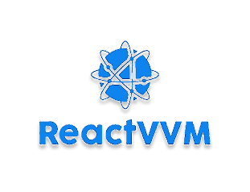

# React vvm [](./LICENSE) [](https://www.npmjs.com/package/reactvvm)
</p align="center">
  <a rel="noopener" target="_blank"></a>
</p>

## Table of contents
- [React vvm](#react-vvm)
  - [Table of contents](#table-of-contents)
  - [Overview](#overview)
  - [Motivation](#motivation)
  - [Getting Started](#getting-started)
    - [Installation](#installation)
    - [IVM (Interface ViewModel)](#ivm-interface-viewmodel)
    - [View](#view)
    - [VM - ViewModel](#vm---viewmodel)
    - [Connection](#connection)
  - [Memoization by vm](#memoization-by-vm)
  - [Dynamic VMs](#dynamic-vms)
  - [Usage with di](#usage-with-di)
## Overview
This library provides a simple, efficient, and reliable solution for MVVM (Model-View-ViewModel) pattern in React applications. It establishes a shared language for robust architectural coding by combining the MVVM architecture with the Bridge pattern, creating a solid foundation for UI development that maximizes maintainability, testability, and reusability.

By explicitly defining ViewModels as the UI logic layer for each view, the library effectively prevents unnecessary re-renders that would otherwise propagate from parent components.

## Motivation
In an era where most frontend communities—particularly the React ecosystem—focus on discussing new tools, libraries, and immediate development solutions, architectural patterns and software engineering fundamentals often receive less attention. However, in professional software engineering, maintainability, testability, and reusability remain the foundational pillars that every developer should prioritize.

Managing UI components and their associated logic—particularly regarding reusability, maintainability, and testability—remains one of the most persistent challenges for frontend engineers. Finding optimal solutions in this domain continues to be a primary focus of the field.

Among the various architectural patterns available for frontend development, MVVM (Model-View-ViewModel) stands out as one of the most practical and reliable approaches. While this pattern has been successfully implemented across numerous frameworks and libraries, I noticed a significant gap in the React ecosystem - the absence of a well-designed MVVM solution that properly adapts to React's unique environment and capabilities.

These considerations led me to create this library - to establish a foundational implementation and shared architectural language for React developers who value proper application structure.

For deeper insights into the library's design philosophy, MVVM architecture, and relevant design patterns, I recommend these articles:

[Cracking the Code: How the MVVM with Bridge Pattern Saves a Messy Frontend UI (Part 1)](https://dev.to/behnamrhp/cracking-the-code-how-the-mvvm-with-bridge-pattern-saves-a-messy-frontend-ui-part-1-3h4)

[Cracking the Code: How the MVVM with Bridge Pattern Saves a Messy Frontend UI (Part 2)](https://dev.to/behnamrhp/cracking-the-code-how-the-mvvm-with-bridge-pattern-saves-a-messy-frontend-ui-part-2-22oc)

## Getting Started

### Installation
npm
```
npm install reactvvm
```

yarn
```
yarn add reactvvm
```

pnpm
```
pnpm install reactvvm
```
### IVM (Interface ViewModel)
The IVM serves as the foundational bridge between UI components and their business logic. This interface explicitly defines the requirements that a View needs from its UI logic to properly render and function.

Example for a button.

```ts
// views/button/button-vm.interface.ts

export default interface ButtonVm {
  props: {
    title: string
    disabled: boolean
  },
  onClick(): void
}
```
> Note: Based on best practices, since this interface serves as the dedicated bridge for a specific view, it should be located with its corresponding view component in the same directory.

### View
The View is a component that:

- Declares its requirements from the ViewModel through a clear interface

- May receive dependencies via props from parent components

- Maintains strict separation between:

  - Parent-provided dependencies

  - Its own UI logic and state management

**Key Principle:**
All UI logic should be encapsulated within the ViewModel, while the View remains focused solely on presentation.

In typical MVVM implementations, Views should primarily re-render only when their ViewModel (VM) changes, not when parent components update. To achieve this goal, Views by default are memoized to prevent unnecessary parent-triggered re-renders.

Also rendering isolation ensures Views only update when their VM changes

To handle these memoization and connection between view and vm, and passing props based on it's ivm, we made a BaseView which handles all these reusable logics and just needed to specify the component in reusable `build` method where you can get your vm and rest of props from parent components.

```tsx
// views/button/button.ts
export default class Button extends BaseView<ButtonVm, { className?: string }> {
  protected Build(
    props: BuildProps<ButtonVm, { className?: string }>,
  ): ReactNode {
    const { vm, restProps } = props;
    const { className } = restProps;
    return (
      <ButtonUi
        className={className}
        disabled={vm.props.disabled}
        onClick={vm.onClick}
      >
        {vm.props.title}
      </ButtonUi>
    );
  }
}
```

In this example parent components control only visual styling based on specific context by (className).

ViewModel handles all ui logic and connection to the logical layer.

In this architecture, the Button component serves as a self-contained, reusable View - a single source of truth for presenting data to the user.

**Key Benefits:**

- Automatic memoization of View components without any time or space complexity.

- Clean separation between View rendering and VM updates

- Type-safe VM prop passing with isolation between parent props and ui logic props.

- Reduced boilerplate for common MVVM patterns
### VM - ViewModel
The ViewModel serves as the UI logic layer - the component that typically exhibits the most variation in implementation.

For instance, a button ViewModel might handle:
- Saving data
- Canceling operations
- Deleting items
- And numerous other context-specific actions

**Problem with Traditional Approach:**

- When using conventional patterns, developers often create parent components to manage multiple child logics. This approach:
- Violates the Single Responsibility Principle
- Introduces unnecessary complexity
- Reduces code readability
- Makes maintenance more difficult

**So we need a reusable component that:**

- Handles all related ui logic internally.

- Passes processed data to the View.

- Connect to the model or any logical layer.

- Can handle react hooks.

To standardize this pattern and ensure all VMs follow the same convention for data exchange with Views (compatible with BaseView), we created BaseVM - the foundational class for all ViewModels.

**Implementation Example: Logout Button**
```ts
// vms/clear-all-data-vm.ts
export default class LogoutButtonVM extends BaseVM<ButtonVm> {
  private model: AuthenticationModel;

  useVM(): ButtonVm {
    const { t } = useTranslation();
    return {
      props: {
        isDisable: false,
        title: t("logout"),
      },
      onClick() {
        this.model.logout();
      },
    };
  }
}
```
As demonstrated in this example, we created a ViewModel by extending BaseVM. To define the required UI contract, we pass the interface to BaseVM as a generic type - the same interface we implemented for the View. This ensures the View remains unaware of any VM variations, simply receiving the interface it needs to render the output.

This architecture enables thousands of different VMs to be reused with a single Button component.

**In this specific implementation, we:**
- Managed the button title through translation
- Connected the click event to the Model's logout method
- Established a clean connection between View and business logic through the ViewModel
### Connection
The final step is to establish a connection between the ViewModel and the View. This is done by passing the ViewModel as a prop to the View component, which will be handled by a parent component.

In this case, the parent component determines which UI logic corresponds to which UI element, without concerning itself with the implementation details.

```tsx
export default function Sidebar() {
  const logoutButtonVm = useRef(new LogoutButtonVM());

  return (
    <aside>
      ...
        <div>
          <Button
            memoizedByVM={false}
            restProps={{
              className: "w-full h-14",
            }}
            vm={logoutButtonVm.current}
          />
        </div>
      ...
    </aside>
  );
}
```
In this example, we created a ref to the ViewModel and passed it as a prop to the Button component.

We also passed other required props to the Button, which are provided by the parent component as a single restProps object.

Additionally, in this example, we disabled memoization based on the vm prop in the Button component. This means that every re-render of the parent component will trigger a re-render of the Button component.

> Note: By default, the Button component is memoized based on the vm changes to be trigerred just by its ui logic.

> Important: Use this architecture when you have a reusable component (like this Button) that can have multiple implementations. If a view has only one implementation, avoid this approach—instead, a custom hook as a ViewModel (VM) is sufficient.

## Memoization by vm 
As mentioned before, one of the key benefits of this architecture is the ability to memoize View components based on the VM changes without any additional complexity.

This approach ensures that a View component only re-renders when its VM changes, preventing unnecessary re-renders caused by parent component updates.

To control this behavior, you can use the memoizedByVM prop (a boolean flag):

- true (default): The View is memoized based on VM changes.

- false: The View ignores VM-based memoization and may re-render due to parent updates.

## Dynamic VMs
Some of the VMs might be require dynamic data from outside to be able to work with specially when it comes to render a list of UI which each one of them needs to work with specific data.

Look at this example:
```tsx
export default class UserInfoCardVM extends BaseVM<
  ICardVM,
  { userId: string }
> {
  ...
  useVM(): ICardVM {
    const user = usePromiseValue(() => this.model.getUserById(this.deps.userId))
    return {
      props: {
        title: user.fullname,
        subTitle: user.email,
        icon: LoginIcon,
      },
    };
  }
  ...
}
```
In this example we have a VM which implement a card view and needs to get the user id from the outside to render detail information of the user.

You can see the BaseVM second generic type which is DEP (dependencies) is responsible for getting the dependencies from the outside.
And from inside of VM we can access to this dependencies by using `this.deps`.

How to use it?

```tsx
function ParentComponent() {
  ...
  const userInfoCards = userIds.map((userId) => {
    const userInfoCardVm = new UserInfoCardVM().produce({ userId }); 
    return <Card key={userId} vm={userInfoCardVm} />
  })
  ...

  return (
    ...
    {userInfoCards}
    ...
  )
}
```
In this example, we have a parent component that maintains a list of user IDs and renders a collection of user information cards. We also have a ViewModel (VM) responsible for providing the necessary data and logic to each card component for rendering user information.

We pass the required dependencies to the VM using the produce method.

## Usage with di
In some frameworks like Next.js, we cannot directly pass ViewModels (VMs) from server components to client components because VMs are not serializable. To work around this limitation, we can use Dependency Injection (DI) to pass a unique key representing the VM instead. The client component can then use this key to retrieve the VM instance through DI.

Implementation Example:
1. Use `ReactVVMDiProvider` to register your DI container in the React context.

2. Register your VM with the DI container using a unique key.

3. Pass only this key (instead of the full VM) to your view component with `vmKey` prop.
```tsx 
...
// In other file
di.register("EXAMPLE_VM_KEY", ExampleVM)
...
// Some server component
export default async function Page() {
  const diRef = useRef(di);
  ...
  return (
    <ReactVVMDiProvider diContainer={diRef.current}>
      <Button vmKey="EXAMPLE_VM_KEY">
    </ ReactVVMDiProvider>
  )
}
```
